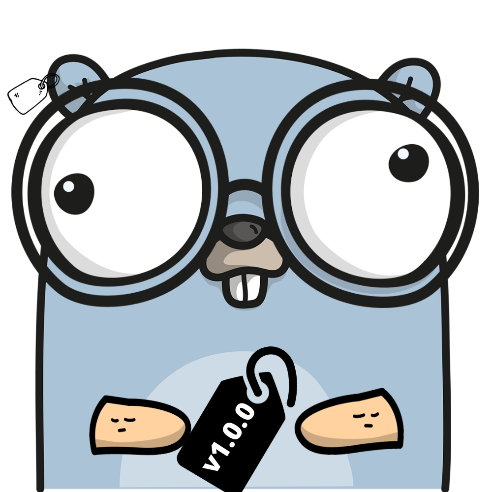

# Taggo


[](https://goreportcard.com/report/github.com/jeorjebot/taggo)
[](https://opensource.org/licenses/MIT)
<!-- [](https://godoc.org/github.com/jeorjebot/taggo) -->

Easy peasy `git tag` utility for lazy people who don't want to remember git commands.

<p align="center">
  
</p>

**Taggo** handles the creation of lightweight tags and pushes them to the remote repository.
Tags are created with the format `vX.Y.Z` where `X` is the major version, `Y` is the minor version and `Z` is the patch version.
It also supports pre-release tags, tags without the `v` prefix, and automatic `CHANGELOG.md` management following the [Keep a Changelog](https://keepachangelog.com/en/1.0.0/) format.

## Table of Contents

- [Installation](#installation)
  - [Go install command](#go-install-command)
  - [From releases](#from-releases)
  - [Homebrew](#homebrew)
- [Usage](#usage)
- [Examples](#examples)
- [Changelog management](#changelog-management)
- [Git commands used by Taggo](#git-commands-used-by-taggo)
- [License](#license)
- [Thanks](#thanks)

## Installation
### Go install command
If you have Go installed, you can use the `go install` command to install the binary.

```bash
go install github.com/jeorjebot/taggo@latest
```
The binary will be installed in `$GOPATH/bin` or `$GOBIN` if set.
Make sure you have `$GOPATH/bin` in your path.

If you're installing from a local clone, use `just install` to bake in the version number.

### From releases
Download the binary for your OS from the [releases page](https://github.com/jeorjebot/taggo/releases).
Make sure the binary is executable, then move it to your path.

```bash
chmod +x /path/to/taggo
mv /path/to/taggo /usr/local/bin
```

### Homebrew
On macOS you can install via Homebrew Cask:

```bash
brew install --cask jeorjebot/tap/taggo
```

## Usage

| Command | Description |
|---------|-------------|
| `taggo` | Show current tag |
| `taggo -v` | Show taggo version |
| `taggo init` / `taggo -i` | Initialize repo with first tag `v0.0.0` |
| `taggo -I` | Initialize repo without `v` prefix (`0.0.0`) |
| `taggo -p` | Bump patch version (e.g. `v1.0.0` -> `v1.0.1`) |
| `taggo -m` | Bump minor version (e.g. `v1.0.0` -> `v1.1.0`) |
| `taggo -M` | Bump major version (e.g. `v1.0.0` -> `v2.0.0`) |
| `taggo -t <tag>` | Create a specific tag (e.g. `v1.0.0`) |
| `taggo -n <name>` | Create a pre-release tag (e.g. `v1.0.0-beta`) |
| `taggo -d` | Delete last tag (local and remote) |
| `taggo -l` | List tags in the current branch with dates |
| `taggo --no-changelog` | Skip automatic CHANGELOG.md update |

## Examples

- Show current tag
```bash
$ taggo
[*] Current tag: v1.0.0
```

- Show taggo version
```bash
$ taggo -v
taggo v1.2.0
```

- Initialize repo
```bash
$ taggo init
[*] Initializing git repo
[*] Added tag v0.0.0
```

- Bump patch version
```bash
$ taggo -p
[*] Current tag: v1.0.0
[*] New tag: v1.0.1
[*] CHANGELOG.md updated: [Unreleased] -> [v1.0.1]
[*] CHANGELOG.md committed
[*] Tag pushed successfully
```

- Create a specific tag
```bash
$ taggo -t v2.0.0
[*] Current tag: v1.0.1
[*] New tag: v2.0.0
[*] CHANGELOG.md updated: [Unreleased] -> [v2.0.0]
[*] CHANGELOG.md committed
[*] Tag pushed successfully
```

- Create a pre-release tag
```bash
$ taggo -n beta
[*] Current tag: v1.0.0
[*] New tag: v1.0.0-beta
[*] CHANGELOG.md updated: [Unreleased] -> [v1.0.0-beta]
[*] CHANGELOG.md committed
[*] Tag pushed successfully
```

- Delete last tag
```bash
$ taggo -d
[*] Current tag: v1.0.1
[*] Deleting tag v1.0.1
[*] Tag deleted successfully
[*] CHANGELOG.md reverted: [v1.0.1] -> [Unreleased]
[*] CHANGELOG.md committed
```

- List tags in current branch
```bash
$ taggo -l
[*] Branch: main
  v0.0.0    2023-04-29
  v1.0.0    2023-04-30
  v1.1.0    2023-05-02
```

## Changelog management

Taggo automatically manages a `CHANGELOG.md` file following the [Keep a Changelog](https://keepachangelog.com/en/1.0.0/) format.

**On tag creation**, the `[Unreleased]` section is moved into a new versioned section with the current date, and comparison links are updated.

**On tag deletion**, the deleted version's section is moved back into `[Unreleased]`.

**If no `CHANGELOG.md` exists**, one is automatically scaffolded with the standard header and an empty `[Unreleased]` section.

To skip changelog management for a single command, use `--no-changelog`:

```bash
$ taggo -p --no-changelog
```

## Git commands used by Taggo
- `git rev-parse --is-inside-work-tree` ==> check if inside a git repo
- `git remote -v` ==> check for remote origin
- `git remote get-url origin` ==> get remote URL
- `git rev-parse --abbrev-ref HEAD` ==> get current branch name
- `git describe --tags --abbrev=0` ==> check if repo has tags
- `git tag --sort=committerdate` ==> list tags sorted by date (last = most recent)
- `git tag --sort=committerdate --format='%(refname:short) %(creatordate:short)'` ==> list tags with dates
- `git merge-base --is-ancestor <tag> HEAD` ==> check if tag is reachable from HEAD
- `git tag v1.0.0` ==> create tag
- `git push origin v1.0.0` ==> push tag to remote
- `git tag -d v1.0.0` ==> delete tag locally
- `git push origin --delete v1.0.0` ==> delete tag on remote
- `git add CHANGELOG.md` ==> stage changelog
- `git commit -m "message"` ==> commit changes

## License
This project is licensed under the Apache License 2.0 - see the [LICENSE](LICENSE.md) file for details

## Thanks
- [autotag](https://github.com/pantheon-systems/autotag) for the inspiration
- [gopherize.me](https://gopherize.me/) for the gopher image
